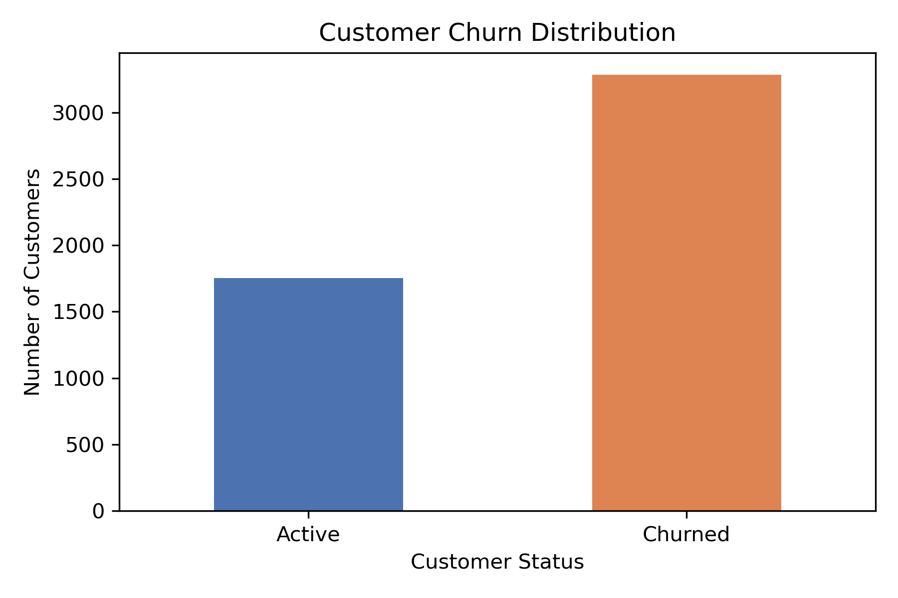
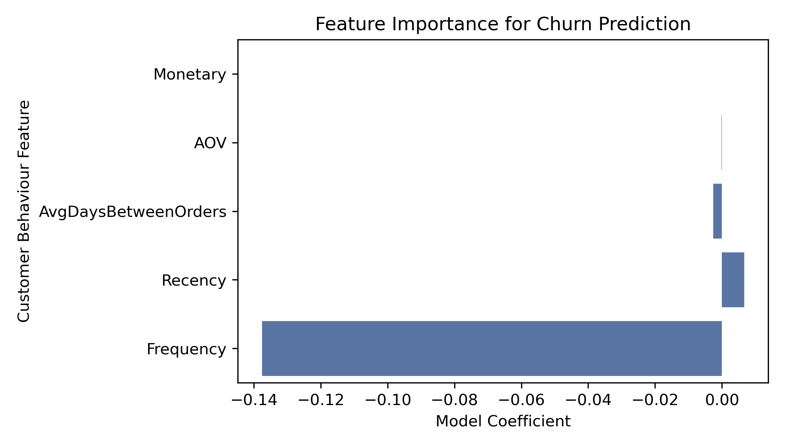
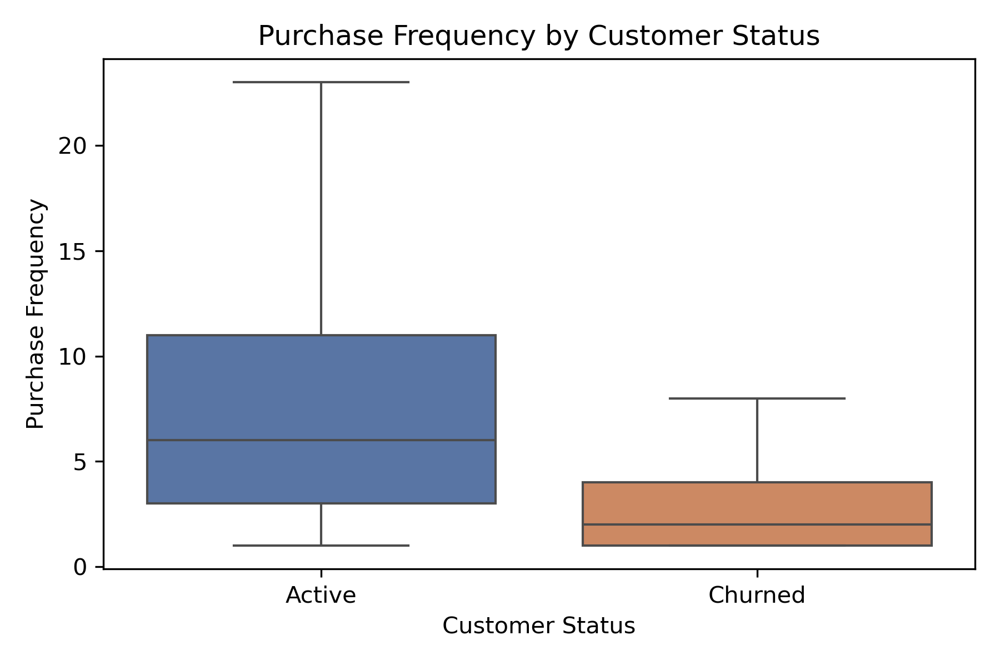
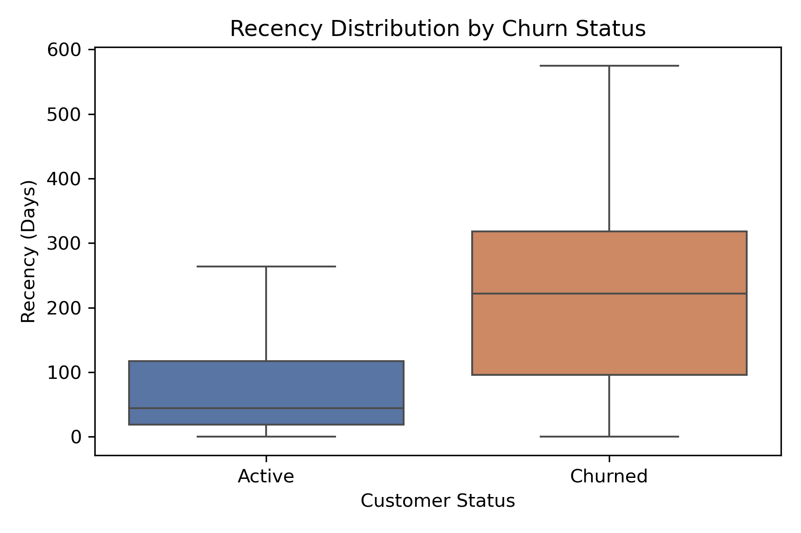
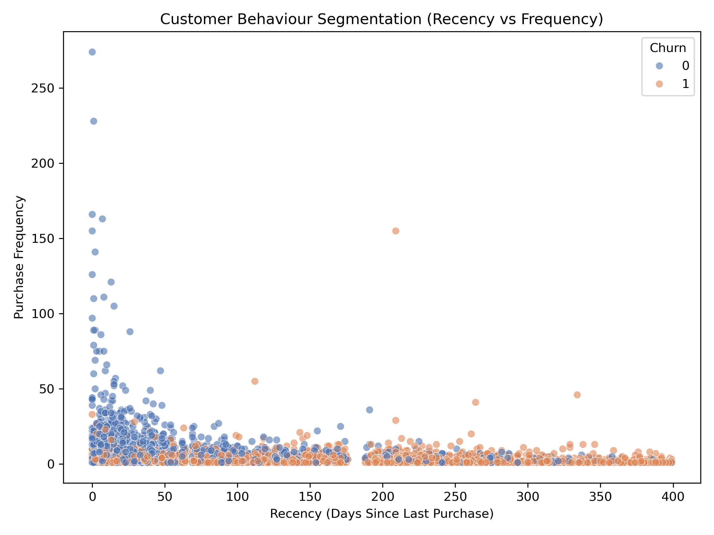
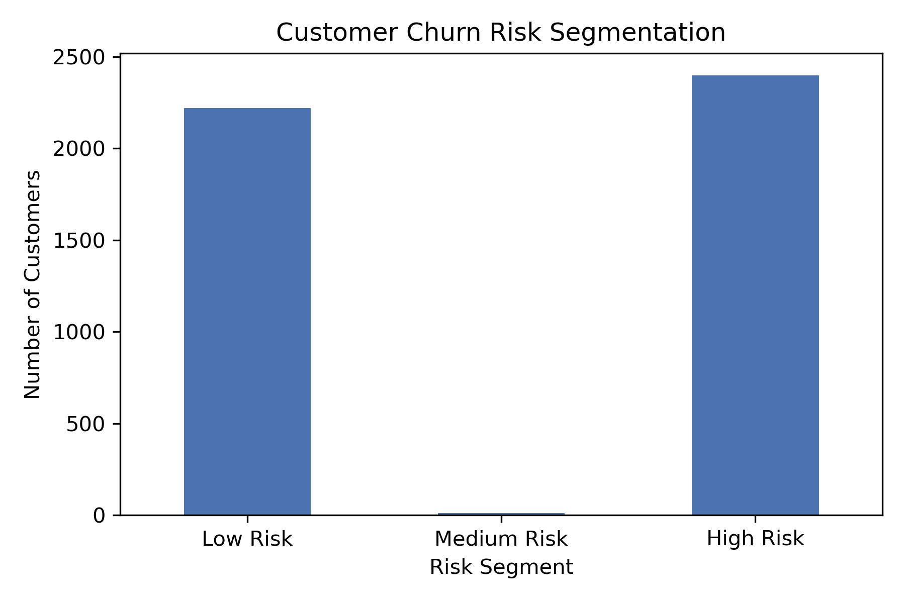

# 📊 Customer Churn Prediction & Behaviour Analysis


## 🚀 Project Snapshot

This project builds a **machine learning system to predict customer churn** using behavioural transaction data from a retail / e-commerce environment.

Key results:

• Analysed **5,038 customers** using behavioural purchase metrics  
• Identified **65.2% customer churn rate** in the dataset  
• Engineered behavioural features including **Recency, Frequency, Monetary, AOV and purchase intervals**  
• Trained machine learning models to predict churn risk  
• Compared **Logistic Regression vs XGBoost** models  
• Best model (**XGBoost**) achieved **81% accuracy and F1 score of 0.86**  
• Segmented customers into **Low, Medium, and High churn risk groups**

The model enables businesses to **identify at-risk customers early and deploy targeted retention strategies to protect future revenue.**

## 🎯 Project Overview

Customer retention is one of the most important challenges for modern retail and e-commerce businesses. Acquiring new customers is significantly more expensive than retaining existing ones, making churn prediction a valuable capability for data-driven organisations.

This project builds a **customer churn prediction system** using behavioural features derived from historical transaction data. The goal is to identify customers who are likely to stop purchasing so that businesses can intervene early and protect future revenue.

The project demonstrates a complete **end-to-end data science workflow**, including:

• Data cleaning  
• Behavioural feature engineering  
• Exploratory data analysis  
• Machine learning modelling  
• Model comparison  
• Churn probability prediction  
• Customer risk segmentation  
• Business insights and recommendations  

The analysis simulates a **transactional retail / e-commerce business**, where customers purchase products intermittently and retention depends on repeat buying behaviour.

---

# 🧠 Business Problem

Retail and e-commerce companies often experience a common pattern:

Many customers make **one purchase and never return**.

Without identifying these customers early, businesses lose potential long-term revenue and must spend heavily on acquiring new customers.

This project addresses the key question:

**Can we predict which customers are likely to churn based on their purchasing behaviour?**

If churn risk can be predicted early, companies can:

• Run targeted retention campaigns  
• Offer personalised incentives  
• Improve marketing efficiency  
• Protect customer lifetime value  

---

# 🗂 Dataset

The dataset contains **historical transaction records** representing customer purchases.

Each customer's behaviour was aggregated into customer-level metrics using the **RFM framework**.

Total customers analysed:

**5,038 customers**

Key variables used in the analysis:

| Feature | Description |
|------|------|
Customer ID | Unique customer identifier |
Frequency | Number of purchases made |
Monetary | Total spending by the customer |
Recency | Days since last purchase |
AOV | Average order value |
AvgDaysBetweenOrders | Average time gap between purchases |
Churn | Target variable (0 = Active, 1 = Churned)

---

# 🧹 Data Cleaning

Real-world transactional datasets require extensive preprocessing before analysis.

The following steps were performed:

• Removed records with missing customer identifiers  
• Removed cancelled or returned transactions  
• Excluded transactions with zero price values  
• Converted date columns to proper datetime format  
• Aggregated transaction-level data into **customer-level behavioural metrics**

These steps transformed raw purchase logs into structured behavioural data suitable for churn modelling.

---

# ⏱ Modelling Framework

To simulate a realistic prediction scenario and avoid data leakage, a **time-based modelling framework** was used.

### Observation Window

Customer behavioural features (Recency, Frequency, Monetary and purchase intervals) were calculated using transactions during the historical observation period.

### Reference Date

A reference date marks the end of the observation window.

Recency was calculated as:

```
Recency = Reference Date − Last Purchase Date
```

### Prediction Window

Customer activity after the reference date was analysed to determine churn labels.

• Customers who **did not purchase again** were labelled **churned**  
• Customers who **returned and made purchases** were labelled **active**

This ensures the model predicts **future behaviour rather than using future data in training**.

---

# ⚙️ Feature Engineering

Customer behaviour was summarised using the **RFM framework** and additional behavioural features.

### Recency

Days since the customer’s last purchase.

Higher recency indicates lower recent engagement.

### Frequency

Total number of purchases made by the customer.

Higher frequency indicates stronger engagement.

### Monetary

Total revenue generated by the customer.

---

### Additional Behaviour Features

Two additional features were engineered.

**Average Order Value**

```
AOV = Monetary / Frequency
```

Measures average spending per purchase.

**Average Days Between Orders**

```
AvgDaysBetweenOrders
```

Represents the average time gap between purchases and captures purchase consistency.

Customers with longer purchase gaps tend to show higher churn risk.

---

# 📊 Exploratory Data Analysis

Behavioural analysis revealed clear differences between churned and active customers.

Churned customers typically show:

• **Higher recency values**  
• **Lower purchase frequency**  
• **Longer gaps between purchases**

These findings suggest that **purchase behaviour is strongly linked to churn risk**.

---

# 📉 Customer Retention Analysis

Customer activity during the prediction window revealed the following distribution:

| Status | Customers | Percentage |
|------|------|------|
Active Customers | 1,753 | 34.8% |
Churned Customers | 3,285 | 65.2% |

This indicates that **approximately two-thirds of customers did not return after their initial purchasing period**, a common pattern in transactional retail environments.

---

# 🤖 Machine Learning Models

Two machine learning models were trained to predict churn.

## Logistic Regression (Baseline Model)

Logistic Regression was used as a baseline due to its simplicity and interpretability.

| Metric | Score |
|------|------|
Accuracy | 0.75 |
F1 Score | 0.82 |

While effective, logistic regression assumes linear relationships between variables.

---

## XGBoost (Advanced Model)

To capture more complex behavioural patterns, an **XGBoost classifier** was trained.

Tree-based models capture **non-linear relationships and interactions between features**.

| Metric | Score |
|------|------|
Accuracy | **0.81** |
F1 Score | **0.86** |

Classification report:

| Class | Precision | Recall | F1 Score |
|------|------|------|------|
Active Customers | 0.75 | 0.68 | 0.71 |
Churned Customers | 0.84 | 0.88 | 0.86 |

---

# 📈 Model Comparison

| Model | Accuracy | F1 Score |
|------|------|------|
Logistic Regression | 0.75 | 0.82 |
XGBoost | **0.81** | **0.86** |

The XGBoost model performed better, indicating that churn behaviour contains **non-linear patterns that tree-based models capture more effectively**.

---

# 🔍 Feature Importance

Model analysis revealed the strongest predictors of churn:

**Frequency** – strongest retention signal  
**Recency** – strongest churn signal  
**AvgDaysBetweenOrders** – indicator of purchase consistency  

Spending metrics such as Monetary and AOV were less predictive, suggesting that **behaviour matters more than total spending**.

---

# 🚨 Customer Risk Segmentation

Predicted churn probabilities were used to segment customers into risk groups.

| Segment | Probability Range |
|------|------|
Low Risk | 0 – 0.3 |
Medium Risk | 0.3 – 0.7 |
High Risk | 0.7 – 1 |

This allows businesses to prioritise retention efforts.

---

# 🎯 Example Business Application

Example predicted customers:

| Customer | Recency | Frequency | Churn Probability | Segment |
|------|------|------|------|------|
12350 | 147 | 1 | 1.00 | High Risk |
12349 | 244 | 3 | 0.89 | High Risk |
12347 | 20 | 5 | ~0.00 | Low Risk |

These predictions allow businesses to focus retention campaigns on customers most likely to churn.

---

# 💡 Business Recommendations

Based on behavioural insights and model predictions:

**Monitor early churn signals**

Customers with increasing recency and declining frequency should be flagged as early churn risk.

**Target high-risk customers**

Retention strategies may include:

• Discount offers  
• Personalised product recommendations  
• Loyalty incentives  

**Encourage repeat purchases**

Since frequency is the strongest retention signal, businesses can promote repeat buying through loyalty programs and remarketing campaigns.

**Prioritise high-value customers**

Customers with high spending but declining engagement represent the greatest revenue risk.

---

# 🔄 Project Workflow

Raw Transaction Data  
↓  
Data Cleaning & Preprocessing  
↓  
Customer Behaviour Feature Engineering (RFM + Behaviour Metrics)  
↓  
Exploratory Data Analysis  
↓  
Model Training  
↓  
Model Comparison (Logistic Regression vs XGBoost)  
↓  
Churn Probability Prediction  
↓  
Customer Risk Segmentation  
↓  
Business Insights & Recommendations

---

# 🛠 Technologies Used

Python  
Pandas  
NumPy  
Matplotlib  
Scikit-learn  
XGBoost  
Jupyter Notebook

---

# 📌 Key Takeaways

This project demonstrates how transactional customer data can be transformed into actionable insights.

Key outcomes:

• Built behavioural features from transaction data  
• Identified behavioural drivers of churn  
• Implemented machine learning models for churn prediction  
• Compared baseline and advanced models  
• Achieved **81% prediction accuracy**  
• Segmented customers into actionable risk groups  
• Generated business recommendations to protect future revenue

---

## 📊 Key Visualizations

### Customer Churn Distribution


### Feature Importance (XGBoost)


### Frequency vs Churn


### Recency vs Churn


### Recency-Frequency Segmentation


### Customer Risk Segmentation


# 👩‍💻 Author

Sanduni Pathiraja  
Aspiring Data Scientist  

Focused on transforming data into meaningful business insights through analytics and machine learning.
